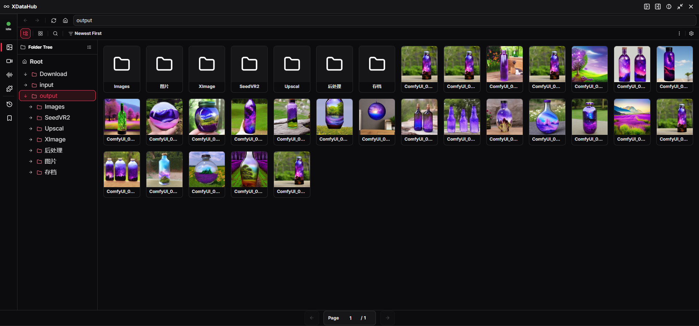

<div align="center">

# ♾️ ComfyUI-Xz3r0-Nodes ♾️

[](https://www.gnu.org/licenses/gpl-3.0)
[](https://github.com/comfyanonymous/ComfyUI)


## For non-Chinese users - Please use web translation 🌍

**如果这个项目对您有帮助，可以给个星标⭐或者分享给其他人！**

[📜 点击查看更新日志 | Click to view the changelog](Changelog.md)


</div>

## 📖 项目简介

- ComfyUI-Xz3r0-Nodes 是一个 ComfyUI 自定义节点项目，当前主要目标为创建增强的基础功能节点和扩展工具

### 🎯 设计特点

- 🌍 多语言界面 - 节点目前支持 🇨🇳 `中文` 🇬🇧 `English` 界面
- 🚫 安全处理 - 节点中可输入的文件名和路径已做防遍历攻击处理，请使用文字，不要使用日期时间标识符以外的特殊符号！

---

> [!WARNING]
> ## 📦 依赖说明（重要必看）
> 本项目当前需要在您的电脑中安装有以下依赖程序：
> - **⚠️ [FFmpeg](https://www.ffmpeg.org/download.html)** - 安装并配置到**系统环境（PATH）**，如果不安装 FFmpeg，那么 `XVideoSave` 和 `XAudioSave` 节点，以及 `XDataHub` 的（图片和视频）缓存缩略图功能将无法正常使用‼️

---

## 💖 安装

### 方法 1: ComfyUI-Manager (推荐)

1. 使用 [ComfyUI-Manager](https://github.com/Comfy-Org/ComfyUI-Manager)
2. 搜索 `ComfyUI-Xz3r0-Nodes`
3. 点击安装按钮


### 方法 2: 手动安装

1. 克隆本仓库到 ComfyUI 的 `custom_nodes` 目录

```bash
cd ComfyUI/custom_nodes
git clone https://github.com/Xz3r0-M/ComfyUI-Xz3r0-Nodes.git
```

2. 安装依赖（可能需要进入 Python 虚拟环境）

```bash
cd ComfyUI-Xz3r0-Nodes
pip install -r requirements.txt
```

3. 重启 ComfyUI

---

<div align="center">

## 节点预览

`♾️ Xz3r0/File-Processing`

|         |                      XAudioSave                       |                      XImageResize                       |                      XImageSave                       |                      XLatentLoad                       |                      XLatentSave                       |                      XMarkdownSave                       |                      XVideoSave                       |                      XWorkflowSave                       |
| :-----: | :---------------------------------------------------: | :-----------------------------------------------------: | :---------------------------------------------------: | :----------------------------------------------------: | :----------------------------------------------------: | :------------------------------------------------------: | :---------------------------------------------------: | :------------------------------------------------------: |
|   中文    |  |  |  |  |  |  |  |  |
| English |  |  |  |  |  |  |  |  |

`♾️ Xz3r0/Workflow-Processing`

|         |                        XAnyGate10                         |                        XAnyToString                         |                        XDateTimeString                         |                       XImageCompare                         |                        XKleinRefConditioning                         |                        XMath                         |                        XMemoryCleanup                         |                        XResolution                         |                        XSeed                         |                        XStringGroup                         |                        XStringWrap                         |
| :-----: | :-------------------------------------------------------: | :---------------------------------------------------------: | :------------------------------------------------------------: | :------------------------------------------------------------------: | :------------------------------------------------------------------: | :--------------------------------------------------: | :-----------------------------------------------------------: | :--------------------------------------------------------: | :--------------------------------------------------: | :---------------------------------------------------------: | :--------------------------------------------------------: |
|   中文    |  |  |  |  |  |  |  |  |  |  |  |
| English |  |  |  |  |  |  |  |  |  |  |  |


`♾️ Xz3r0/XDataHub`

|         |                  XAudioGet                    |                  XDataSave                    |                  XImageGet                    |                  XLoraGet                    |                  XStringGet                    |                  XVideoGet                    |
| :-----: | :-------------------------------------------: | :-------------------------------------------: | :-------------------------------------------: | :------------------------------------------: | :--------------------------------------------: | :-------------------------------------------: |
|   中文    |  |  |  |  |  |  |
| English |  |  |  |  |  |  |

---

## XDataHub 预览


---

## XMetadataWorkflow 预览

🌐 在线使用：https://xz3r0-m.github.io/ComfyUI-Xz3r0-Nodes


</div>

---

> [!IMPORTANT]
> ## 👇 点击查看功能详细说明
> - [🎁 Nodes - 节点](https://github.com/Xz3r0-M/ComfyUI-Xz3r0-Nodes/wiki/1-%E2%80%90-Nodes)
> - [🧩 Extensions - 网页扩展](https://github.com/Xz3r0-M/ComfyUI-Xz3r0-Nodes/wiki/2-%E2%80%90-Extension)
---

## 📞 项目链接

- **Github 项目主页**: [https://github.com/Xz3r0-M/ComfyUI-Xz3r0-Nodes](https://github.com/Xz3r0-M/ComfyUI-Xz3r0-Nodes)
- **问题反馈**: [GitHub Issues](https://github.com/Xz3r0-M/ComfyUI-Xz3r0-Nodes/issues)
- **Comfy Registry 主页**: [Comfy Registry](https://registry.comfy.org/zh/publishers/xz3r0/nodes/xz3r0-nodes)

---

## 🙏 致谢

- [ComfyUI](https://github.com/comfyanonymous/ComfyUI) - 强大的基于节点的图像生成 UI
- [FFmpeg](https://www.ffmpeg.org/download.html) - 音频/视频处理
- [jtydhr88](https://github.com/jtydhr88/comfyui-custom-node-skills) - 开发 Skills
- [ComfyUI-Lora-Manager](https://github.com/willmiao/ComfyUI-Lora-Manager) - 为 XDataHub 的 Lora 加载方式 提供了一些灵感
- [ComfyUI-Manager](https://github.com/Comfy-Org/ComfyUI-Manager) - 便捷安装方式

---

## 📄 许可证

- 本项目采用 GPL-3.0 许可证 - 详见 [LICENSE](LICENSE) 文件
